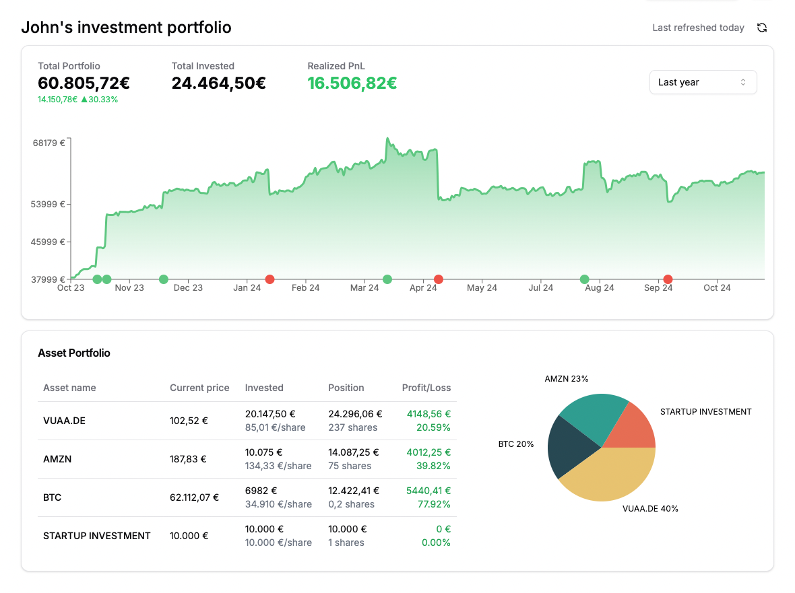

# QianBao Finance - Simple and Privacy-First Investment Portfolio Tracker

QianBao (钱包, meaning "wallet" in Chinese) is an open-source investment portfolio tracker that helps you monitor your financial assets in one place, just like a wallet does for your cash and cards.



## Features

### 🔍 All Your Investments in One Place

-   Track stocks, ETFs, and cryptocurrencies
-   Get a comprehensive overview of your entire portfolio
-   Monitor asset allocation and performance metrics
-   Real-time price updates

### 📊 Real-Time Net Worth Tracking

-   Monitor aggregated net worth in real-time
-   Live asset value updates
-   Instant snapshot of your financial status
-   Historical performance tracking

### 🔒 Maximum Data Protection

-   Open-source code for transparency
-   Robust security measures
-   End-to-end encryption
-   Your data remains private and secure

### 📈 Effortless Performance Tracking

-   Intuitive dashboards
-   Clear investment growth insights
-   Trend analysis tools
-   Informed decision-making support

## Tech Stack

-   **Framework**: Next.js 14
-   **Database**: MongoDB
-   **Authentication**: NextAuth.js
-   **APIs & Services**:
    -   [Alpha Vantage API](https://www.alphavantage.co/documentation/) for financial data
    -   [TickerSymbol](https://github.com/yashwanth2804/TickerSymbol) for asset suggestions
-   **Analytics**:
    -   [Plausible Analytics](https://plausible.io) privacy-friendly analytics
-   **UI Components**:
    -   Radix UI
    -   Shadcn/ui
    -   Recharts for charts

## Getting Started

### Prerequisites

-   Node.js 18+
-   MongoDB instance
-   Alpha Vantage API key

### Environment Variables

Create a `.env.local` file in the root directory:

```env
# MongoDB
MONGODB_URI=your_mongodb_connection_string

# NextAuth
NEXTAUTH_URL=http://localhost:3000
NEXTAUTH_SECRET=your_nextauth_secret

# Alpha Vantage API
ALPHA_VANTAGE_API_KEY=your_api_key

# Optional: Analytics
NEXT_PUBLIC_PLAUSIBLE_DOMAIN=your_domain
```

### Installation

1. Clone the repository:
   git clone https://github.com/ericcapella/qianbao.git
   cd qianbao
2. Install dependencies:
   npm install
3. Run the development server:
   npm run dev

4. Open [http://localhost:3000](http://localhost:3000) with your browser.

## Contributing

Contributions are welcome! Please feel free to submit a Pull Request. For major changes, please open an issue first to discuss what you would like to change.

## License

This project is licensed under the GNU General Public License v3.0 (GPL-3.0). This means that any distributed copies or modifications of this software must also be released under the GPL-3.0 license, ensuring that derivatives remain open source.

## Alternatives

For a list of alternative portfolio trackers, check out:

-   [Ghostfolio](https://ghostfol.io/) - Open source wealth management software
-   [Portfolio Performance](https://www.portfolio-performance.info/) - Open source portfolio management software
-   [Getquin](https://www.getquin.com/) - Investment portfolio tracker
-   [SimplePortfolio](https://simpleportfolio.app/) - Minimalist portfolio tracker
-   [Portseido](https://www.portseido.com/) - Investment portfolio management tool
